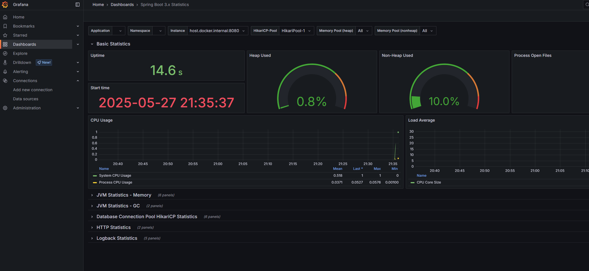

# payment-api

This repository contains Payment API.

## Building

`mvn clean package`

## Local running

Run other necessary services (db,kafka) with docker compose:
```shell
docker-compose up -d
```

Run the app with local profile:


## Postman
- Can be found under contract/postman directory
- Please change postman collection after you change the apis

## OpenAPI
- Can be found under contract/open-api directory
[Payment REST API](http://localhost:8080/swagger-ui.html)
- After API changes, OpenApi yaml generation: start the application and run
```shell
mvn springdoc-openapi:generate
```
- In case of new request/response dto introduction/change a new json should be placed under resources/examples directory. The name should be the same as the name of the schema (@Schema(name="?")).

## Docker
- The service is dockerized for easy deployment to cloud
- To create the image use:
```shell
docker build  -t payment-service .  
```

## High availability
- Prometheus and grafana are added to the compose file

- Todo dashboard and datasources can be configured via yml to have the screenshot without volumes


## Todos
- Implement unit test for the service classes (which were not part of the assignment)
- Implement spring integration test for endpoints (which were not part of the assignment)
- Create application.yml files for the different envs
- Implement different validation related negative cases for PaymentControllerIT (fe: negative amount)
- Implement error handling for other kind of exception (HttpMessageNotReadableException)