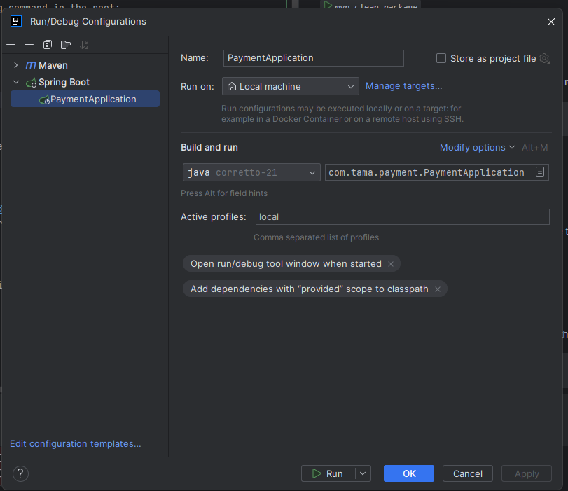

# payment-api

This repository contains Payment API.

## Building

`mvn clean package`

## Local running

Run other necessary services (db,kafka) with docker compose:
```shell
docker-compose up -d
```

Run the app with local profile:


## Postman
- Please change postman collection after you change the apis

## OpenAPI

[Payment REST API](http://localhost:8080/swagger-ui.html)
- After API changes, OpenApi yaml generation: start the application and run
```shell
mvn springdoc-openapi:generate
```
- In case of new request/response dto introduction/change a new json should be placed under resources/examples directory. The name should be the same as the name of the schema (@Schema(name="?")).
